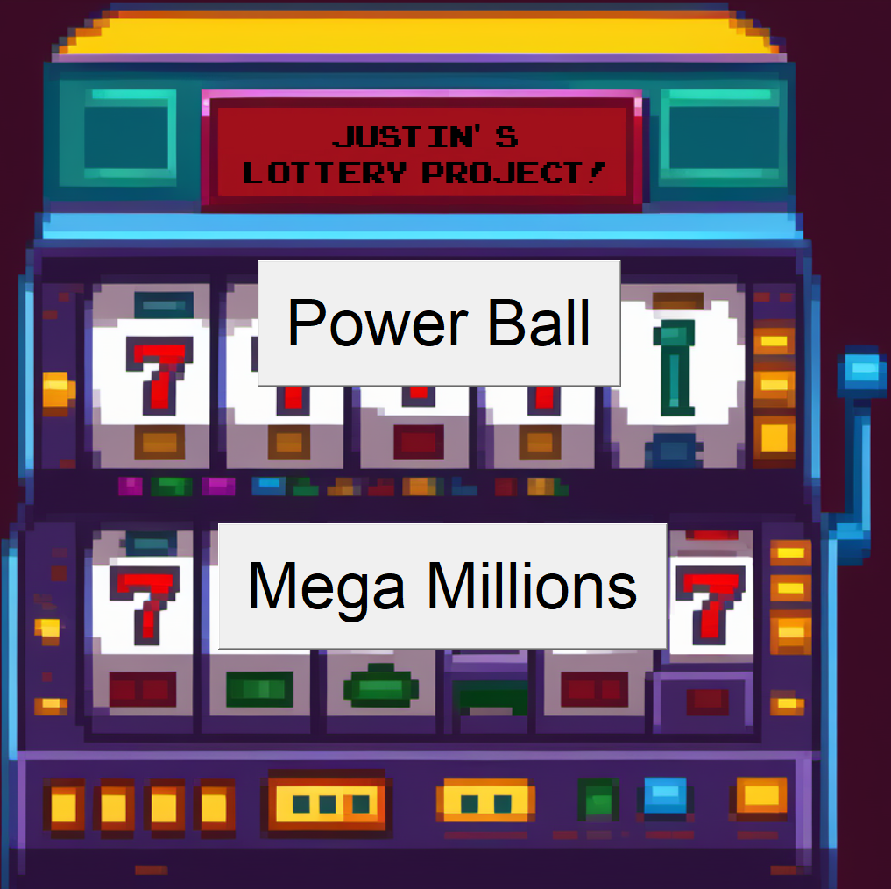

# Lottery Ticket Printer

<p> 
    
</p>


## Table of Contents
1. [Description](#description)
2. [Screenshots](#screenshots)
3. [Live Website](#live-website)
4. [Installation](#installation)
5. [License](#license)

## Description

This project simulates buying Powerball or Mega Millions lottery tickets from a convenience store.

## Screenshots




## Installation
To clone the repo:
```
git clone https://github.com/JustinSnyder611/Lottery-Ticket-Printer
``` 
Run 'Ticket_Printer.py' to start the program

## License
[](https://opensource.org/licenses/MIT) 
